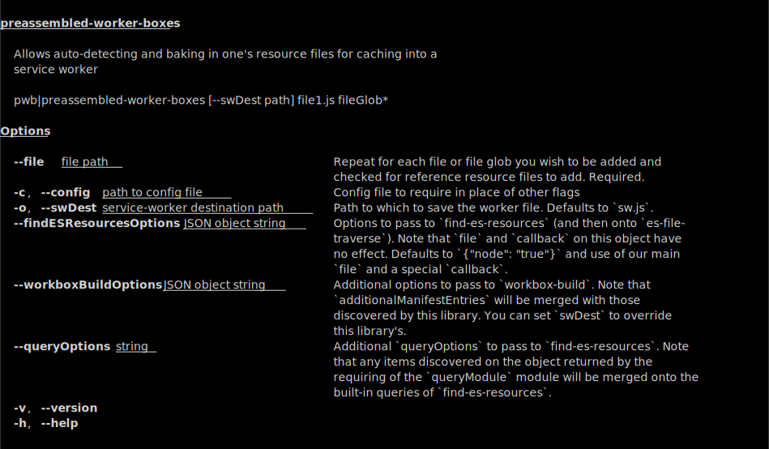

# preassembled-worker-boxes

**This project is minimally functional.**

This project is meant to help assist you auto-detect your resource files
(those which an entry file imports or relevant `fetch` or such statements
found within those files)

*We currently have very limited support for syntactic structures*
*where the resource files can be found. See [`find-es-resources`](https://github.com/brettz9/find-es-resources).*

We use
[workbox-build](https://developers.google.com/web/tools/workbox/reference-docs/latest/module-workbox-build)
to build a service-worker which caches the files that your application
fetches, etc.

## Install

```shell
npm i preassembled-worker-boxes
```

## CLI Usage



## See also

- [find-es-resources](https://github.com/brettz9/find-es-resources)

## Changelog

The changelog can be found on [CHANGES.md](./CHANGES.md).

## Authors and license

[Brett Zamir](http://brett-zamir.me/) and
[contributors](https://github.com/brettz9/preassembled-worker-boxes/graphs/contributors).

MIT License, see the included [LICENSE-MIT.tx](LICENSE-MIT.txt) file.

## To-dos

1. Add binary tests (and get to full coverage).
1. Use [find-resources](https://www.npmjs.com/package/find-resources) to
    bundle files found during the parsing of HTML and CSS files
